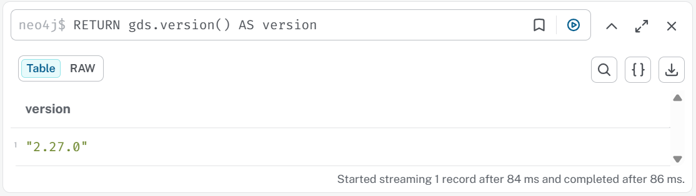

# Community Search

**Part 3. GraphRAG 핵심 패턴과 평가**

- Chapter 01. GraphRAG 구축하기
    - 📒 Clip 08. [실습] 커뮤니티 검색 구현하기

> Neo4j Graph Data Science (GDS) 를 활용한 커뮤니티 탐지와 GraphRAG를 구현합니다.

## 커뮤니티 탐지란?

**커뮤니티(Community)** = 그래프 내에서 **서로 밀집되게 연결된 노드들의 그룹**

---

## 실습 순서

### 1. 패키지 설치

Python 3.13

```bash
# uv 설치
# Windows (PowerShell)
powershell -ExecutionPolicy ByPass -c "irm https://astral.sh/uv/install.ps1 | iex"

# macOS / Linux
curl -LsSf https://astral.sh/uv/install.sh | sh
```

```bash
# 방법 1: uv sync 사용 (권장)
uv sync
.venv\Scripts\activate
```

또는

```bash
# 방법 2: requirements.txt 사용
uv venv
.venv\Scripts\activate
uv pip install -r requirements.txt
```

**Jupyter Notebook 사용시 커널 등록:**

```bash
.venv\Scripts\python.exe -m ipykernel install --user --name=community --display-name="community"
```


### 2. 환경변수 설정

```bash
cp .env.example .env
```

```bash
NEO4J_URI=neo4j+s://<your-instance>.databases.neo4j.io
NEO4J_USERNAME=neo4j
NEO4J_PASSWORD=your_password_here

OPENAI_API_KEY=your_openai_api_key_here
```


---


## [Neo4j GDS](https://neo4j.com/docs/graph-data-science/current/algorithms/) 사용법



```
RETURN gds.version() AS version
```

### 1) Graph Projection (메모리 로드)

GDS 알고리즘은 **in-memory graph**에서 동작합니다.

```cypher
CALL gds.graph.project(
    'Graph',                          // 그래프 이름
    ['A', 'B', 'C'],  // 노드 레이블
    ['R1', 'R2', 'R3']      // 관계 타입
)
```

### 2) Community Detection 실행

#### Leiden Algorithm

```cypher
// 1. Stream 모드 (결과만 확인)
CALL gds.leiden.stream('Graph')
YIELD nodeId, communityId
RETURN gds.util.asNode(nodeId).name AS name, communityId
LIMIT 10

// 2. Mutate 모드 (in-memory graph에 속성 추가)
CALL gds.leiden.mutate('Graph', {
    mutateProperty: 'communityId',
    maxLevels: 10,
    tolerance: 0.0001
})

// 3. Write 모드 (Neo4j DB에 영구 저장)
CALL gds.leiden.write('Graph', {
    writeProperty: 'communityId',
    maxLevels: 10
})
```

### 3) 커뮤니티 통계 확인

```cypher
// 커뮤니티별 노드 수
CALL gds.leiden.stream('Graph')
YIELD communityId
RETURN communityId, count(*) as members
ORDER BY members DESC
```

### 4) Graph 메모리 정리

```cypher
CALL gds.graph.drop('Graph')
```

---

## H&M Retail 커뮤니티 탐지 (구매 행동 기반)

### 파일 구조

```
community_search/
├── community_detection_retail.py      # 구매 행동 기반 커뮤니티 탐지
└── retail_community_graphrag.py       # 커뮤니티 기반 상품 추천 GraphRAG
```

### 실행 순서

```bash
# 1. H&M 데이터 로드 (이미 완료된 경우 생략)
cd ../part2/retail2kg
python retail2kg.py

# 2. Neo4j 메모리 설정 (8GB RAM 환경)
# Neo4j Desktop → Settings → Memory
#   dbms.memory.heap.max_size=2g
#   dbms.memory.pagecache.size=1g
# 재시작 필요

# 3. 상품 커뮤니티 탐지 실행
cd ../../part3/community_search
python community_detection_retail.py

# 4. 상품 추천 테스트
python retail_community_graphrag.py
```
