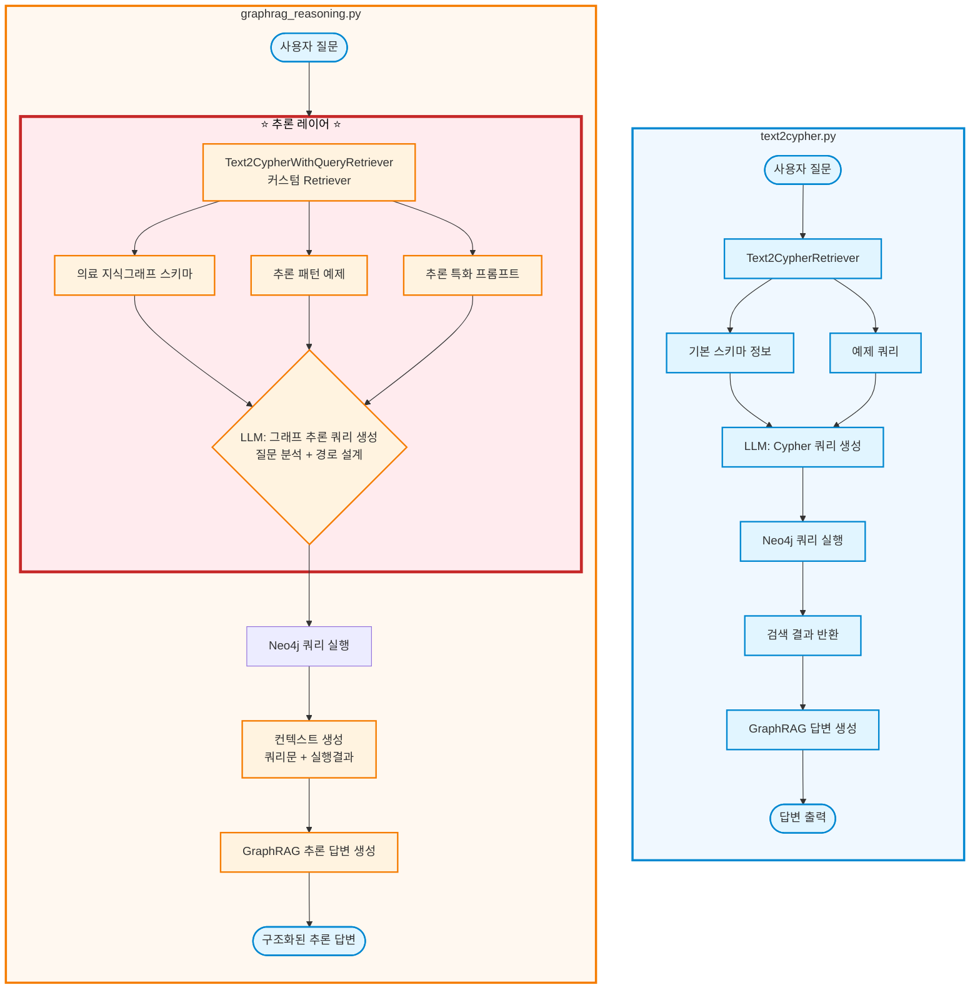

```mermaid
graph TB
    %% 기본 Text2Cypher 파이프라인
    subgraph BasicFlow["text2cypher.py"]
        direction TB
        Start1([사용자 질문])
        Start1 --> B1[Text2CypherRetriever]
        B1 --> B2[기본 스키마 정보]
        B1 --> B3[예제 쿼리]
        B2 --> B4[LLM: Cypher 쿼리 생성]
        B3 --> B4
        B4 --> B5[Neo4j 쿼리 실행]
        B5 --> B6[검색 결과 반환]
        B6 --> B7[GraphRAG 답변 생성]
        B7 --> End1([답변 출력])
    end

    %% 추론 강화 GraphRAG 파이프라인
    subgraph ReasoningFlow["graphrag_reasoning.py"]
        direction TB
        Start2([사용자 질문])

        Start2 --> ReasoningLayer

        subgraph ReasoningLayer["⭐ 추론 레이어 ⭐"]
            direction TB
            R1[Text2CypherWithQueryRetriever<br/>커스텀 Retriever]
            R2[의료 지식그래프 스키마]
            R3[추론 패턴 예제]
            R4[추론 특화 프롬프트]
            R5{LLM: 그래프 추론 쿼리 생성<br/>질문 분석 + 경로 설계}

            R1 --> R2
            R1 --> R3
            R1 --> R4
            R2 --> R5
            R3 --> R5
            R4 --> R5
        end

        R5 --> R7[Neo4j 쿼리 실행]
        R7 --> R9[컨텍스트 생성<br/>쿼리문 + 실행결과]
        R9 --> R10[GraphRAG 추론 답변 생성]
        R10 --> End2([구조화된 추론 답변])
    end

    %% 스타일링
    classDef basic fill:#e1f5ff,stroke:#0288d1,stroke-width:2px
    classDef reasoning fill:#fff3e0,stroke:#f57c00,stroke-width:2px
    classDef highlight fill:#ffe0f0,stroke:#d81b60,stroke-width:2px

    class B1,B2,B3,B4,B5,B6,B7 basic
    class R1,R2,R3,R4,R5,R8,R9,R10 reasoning
    class R6 highlight

    style BasicFlow fill:#f0f8ff,stroke:#0288d1,stroke-width:3px
    style ReasoningFlow fill:#fff8f0,stroke:#f57c00,stroke-width:3px
    style ReasoningLayer fill:#ffebee,stroke:#c62828,stroke-width:4px,color:#000
```