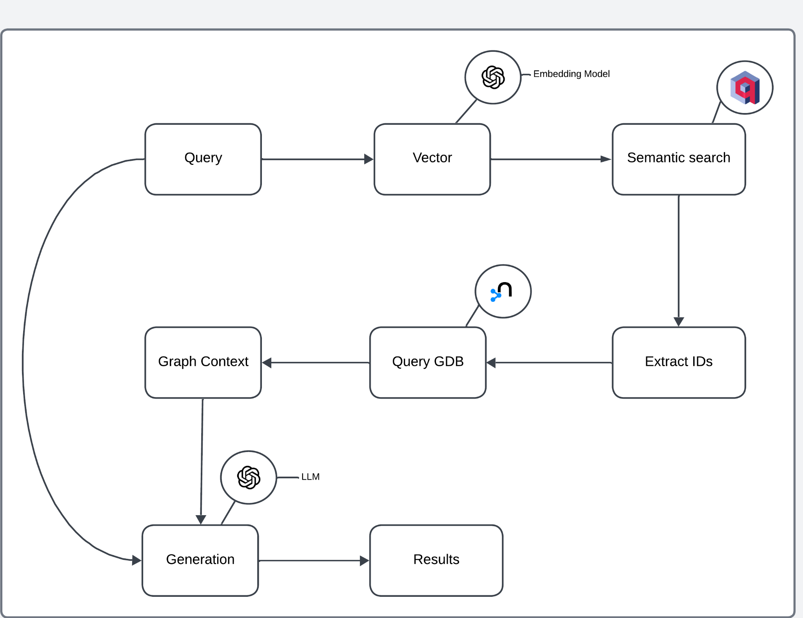

# VectorCypher Search(Qdrant)

**Part 3. GraphRAG 핵심 패턴과 평가**

- Chapter 01. GraphRAG 구축하기
    - 📒 Clip 07. [프로젝트] Vector + Graph - 벡터 데이터베이스(Qdrant)와 함께 사용하기

> pdf2kg로 구축한 문서 지식그래프의 텍스트 정보를 Qdrant(벡터 데이터베이스)에 담고, 벡터 검색과 그래프 탐색을 결합한 GraphRAG를 구현합니다.

---




---

## 실습 순서

### 1. 사전 준비: pdf2kg 데이터 적재

이 프로젝트는 **part2/pdf2kg**를 통해 문서 지식그래프가 Neo4j에 이미 적재되어 있어야 합니다.

```bash
cd ../../part2/pdf2kg
python pdf2kg.py
python pdf2kg_2.py
```

## 2. Qdrant 설정

### Qdrant Cloud

1. [Qdrant Cloud](https://cloud.qdrant.io/) 접속
2. 무료 클러스터 생성
3. 클러스터 정보 저장:
   - **URL**: `https://xxxxxxxx-xxxx-xxxx-xxxx-xxxxxxxxxxxx.us-east.aws.cloud.qdrant.io:6333`
   - **API Key**: 클러스터 설정에서 생성


### 3. 패키지 설치

Python 3.13

```bash
# uv 설치
# Windows (PowerShell)
powershell -ExecutionPolicy ByPass -c "irm https://astral.sh/uv/install.ps1 | iex"

# macOS / Linux
curl -LsSf https://astral.sh/uv/install.sh | sh
```

```bash
cd part3/vectorcypher_qdrant
```

```bash
# 방법 1: uv sync 사용 (권장)
uv sync
.venv\Scripts\activate
```

또는

```bash
# 방법 2: requirements.txt 사용
uv venv
.venv\Scripts\activate
uv pip install -r requirements.txt
```

### 4. 환경변수 설정

```bash
cp .env.example .env
```

```bash
NEO4J_URI=neo4j+s://<your-instance>.databases.neo4j.io
NEO4J_USERNAME=neo4j
NEO4J_PASSWORD=your_password_here

OPENAI_API_KEY=your_openai_api_key_here
```

---

## 5. Qdrant에 임베딩 생성

```bash
python ingest_to_qdrant.py
```

## 6. Qdrant 기반 Vector Cypher GraphRAG 실행

```bash
python vectorcypher_qdrant.py
```
